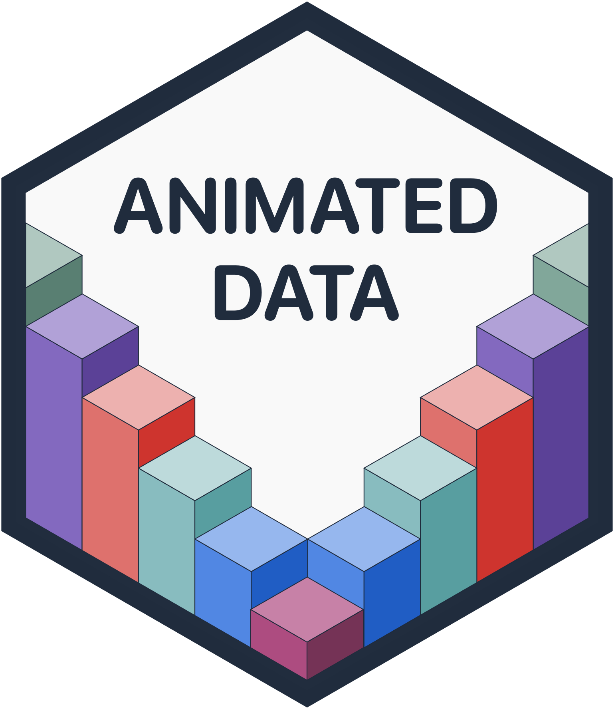

# Welcome to Animated Data

  

Animated Data is an online, interactive book of simple, reproducible animations to help explain data science concepts. You can view the book at http://www.tomasbeuzen.com/animated-data/.

## Building the Animated Data book

If you'd like build the animated-data book from source, you should:

1. Clone this repository and run
2. Run `pip install requirements.txt` (it is recommended you do this within a virtual environment)
3. Run `jupyter-book build animated-data/`

A fully-rendered HTML version of the book will be built in animated-data/_build/html/

## Contributing

Contributions are welcome and greatly appreciated! If you're interested in contributing to this project, take a look at the [contributor guide](CONTRIBUTING.md).

## Contributors

All contributions are welcomed and recognized! You can see a list of current contributors in the [contributors tab](https://github.com/TomasBeuzen/animated-data/graphs/contributors).

## Acknowledgements

This online book is created using the excellent open source [Jupyter Book project](https://jupyterbook.org/). Go check it out!